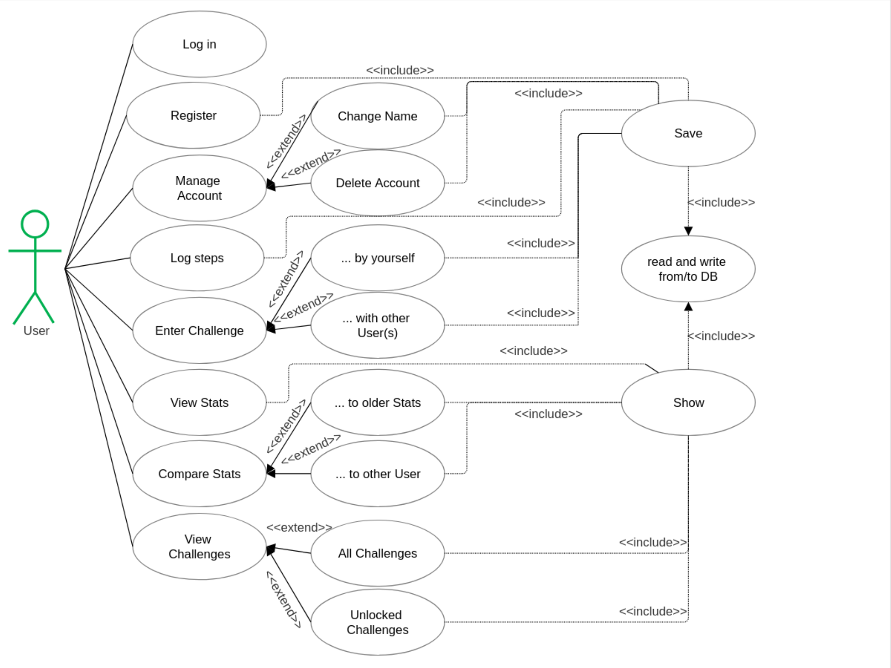

# Use Case Overview

## Introduction
This document provides an overview of all use cases for the system.

## Use Case Diagram

## Use Case List

| ID    | Use Case Name           | Primary Actor | Priority | Status |
|-------|-------------------------|---------------|----------|--------|
| UC-01 | Log in                  | User          | High     | Done   |
| UC-02 | Register                | User          | High     | Done   |
| UC-03 | Manage Account          | User          | Low      | WIP    |
| UC-04 | Change Name             | User          | Low      | WIP    |
| UC-05 | Delete Account          | User          | Low      | WIP    |
| UC-06 | Log Activity            | User          | High     | Done   |
| UC-07 | Enter Challenge         | User          | High     | Done   |
| UC-08 | Create Challenge        | User          | Medium   | Done   |
| UC-09 | View Stats              | User          | High     | Done   |
| UC-10 | Compare Stats(Activity) | User          | Low      | WIP    |
| UC-11 | Compare timeframes      | User          | Low      | WIP    |
| UC-12 | Compare to User         | User          | Low      | WIP    |
| UC-13 | View all Challenges     | User          | Medium   | Done   |

## Actors

### User
**Description:** End-User of the application
**Responsibilities:** using the application by logging activities and entering challenges

