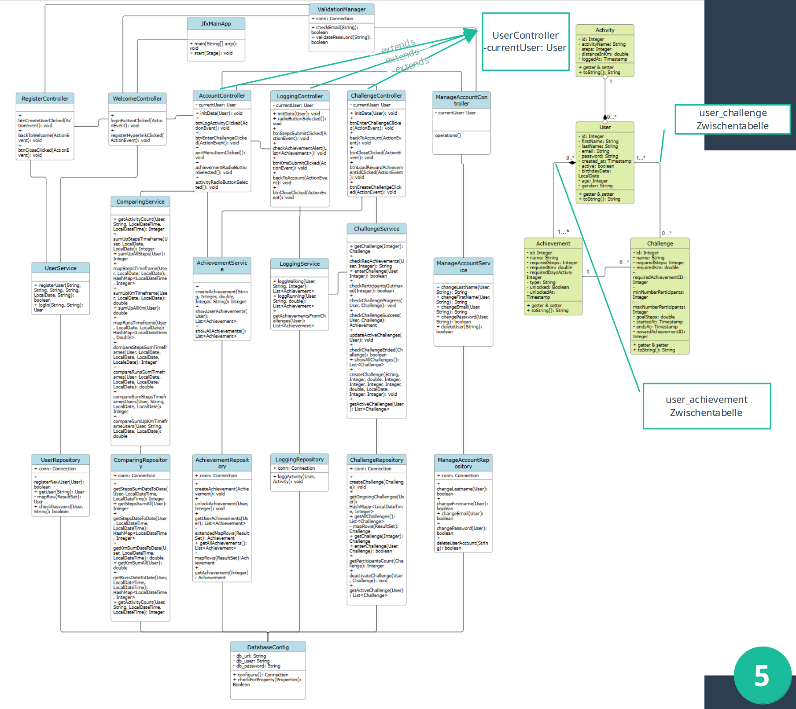

# Class Diagrams

## Overview
This document contains UML class diagrams for the system design.

## Class Diagram 1: 

### Description
This class diagram represents the monolithic application as a whole, featuring all existing classes.

### Diagram

### Key Classes

#### Class: JfxMainApp
**Responsibilities:**
- starting the JavaFX app
- loading the initial UI

**Relationships:**
- by loading the first View.fxml it indirectly triggers the Controller classes.

#### Class:DatabaseConfig
**Responsibilities:**
- checks for the configuration of the database from different sources
- makes Connection to database

#### Class: ValidationManager
**Responsibilities:**
- checks for email in the database
- validates password

**Relationships:**
- fetches Connection from DatabaseConfig

#### Class: *Controller(s)
**Responsibilities:**
- connects the *View.fxml with the Models (User, Challenge, Achievement). 
- hands over the user input to the Service layer. 
- collects data from the Service layer and displays it in the user interface.
- leads to other *View.fxml and therefor other *Controller(s).

**Relationships:**
- connects to the Models (User, Challenge, Achievement).
- interacts with the Service layer.
- connects to other *View(s) and therefor other *Controller(s).

#### Class: User (Model)
**Responsibilities:**
- serves as a data- and fxml-model for Users.
- calculates the age of a User.

#### Class: Activity (Model)
**Responsibilities:**
- serves as a data- and fxml-model for Activities.

#### Class: Achievement (Model)
**Responsibilities:**
- serves as a data- and fxml-model for Achievements.

#### Class: Challenge (Model)
**Responsibilities:**
- serves as a data- and fxml-model for Challenges.

#### Class: UserService
**Responsibilities:**
- creates User(s)
- hands over User to UserRepository for insertion to database (register new User)
- fetches User(s) from UserRepository (login)

**Relationships:**
- uses UserRepository
- uses AchievementRepository
- creates User(s)

#### Class: ComparingService
**Responsibilities:**
- performs calculations and comparisons of User Data (Activities).
- reformates LocalDate to LocalDateTime
- fetches User from UserRepository
- fetches data from ComparingRepository

**Relationships:**
- uses UserRepository
- uses ComparingRepository

#### Class: AchievementService
**Responsibilities:**
- creates Achievement(s)
- fetches lists of Achievements from AchievementRepository

**Relationships:**
- uses AchievementRepository
- creates Achievement(s)

#### Class: ActivityService
**Responsibilities:**
- creates Activities
- checks if Activities unlock Achievements

**Relationships:**
- creates Activity
- uses ActivityRepository
- uses AchievementRepository
- interacts with ChallengeService

#### Class: ChallengeService
**Responsibilities:**
- creates Challenges
- enters Users in Challenges
- checks on Challenge progress
- checks if Challenge ended
- checks if Challenge was successfully finished

**Relationships:**
- creates Challenge
- uses ChallengeRepository
- uses AchievementRepository
- uses ComparingRepository

#### Class: ManageAccountService
**Responsibilities:**
- hands over User Changes to the ManageAccountRepository

**Relationships:**
- uses ManageAccountRepository
- uses ValidationManager

#### Class: UserRepository
**Responsibilities:**
- managing any database operations concerning:
  + saving User to database (register new User)
  + creating User 
  + fetching User from database (login)

**Relationships:**
- fetches Connection from DatabaseConfig

#### Class: ComparingRepository
**Responsibilities:**
- managing any database operations concerning Calculations and Comparisons of User Activities:
    + summarizing Activities from User in specific timeframe
    + summarizing all Activities from User
    + creating a HashMap of LocalDateTime and Steps/Kilometers of an Activity (of a User) in specific timeframe
    + counting entries of Activity (steps OR kilometers) of a User in a specific timeframe

**Relationships:**
- fetches Connection from DatabaseConfig

#### Class: AchievementRepository
**Responsibilities:**
- managing any database operations concerning Achievements:
    + inserting Achievement into database
    + unlocking Achievement (inserting User + AchievementID into user_achievement in database)
    + fetching and creating Achievement(s) of User from database
    + creating lists of Achievement(s)

**Relationships:**
- creates Achievement(s)
- fetches Connection from DatabaseConfig

#### Class: ActivityRepository
**Responsibilities:**
- managing the database operation to insert an entry in the table activity

**Relationships:**
- fetches Connection from DatabaseConfig

#### Class: ChallengeRepository
**Responsibilities:**
- managing any database operations concerning Challenges
    + inserting Challenge into database
    + fetching Challenges from database
    + creating HashMap of LocalDateTime(entered_at) and Integer(challenge_id) of ongoing Challenges
    + creating lists of Challenges
    + entering User into Challenge (inserting user_id and challenge_id into table user_challenge)
    + counting actively participating Users in Challenge
    + deactivating Challenge for User (update to database)

**Relationships:**
- fetches Connection from DatabaseConfig

#### Class: ManagingAccountRepository
**Responsibilities:**
- managing any database operations concerning changes to Users:
    + updating user data in table user_walkitof
    + deleting user from database

**Relationships:**
- fetches Connection from DatabaseConfig

