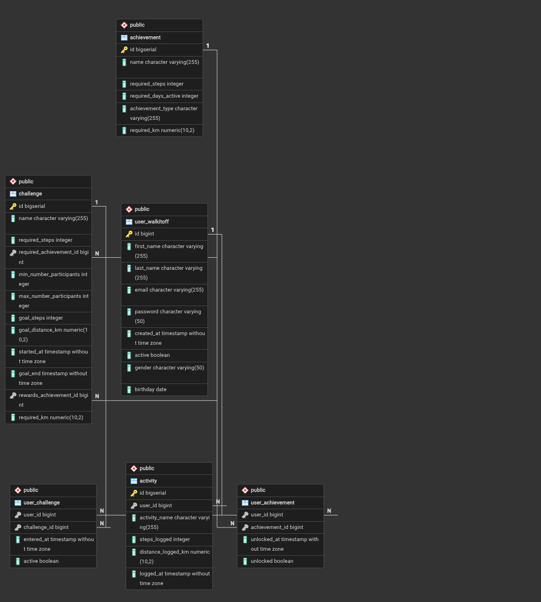

# Data Model and Database Mapping

## Overview
This document describes the data model and how it maps to the database schema.

The detailed SQL file for the creation of all tables can be found here:

at.elisabeth_tulla.walt_it_off/sql/create_tables.sql

## Conceptual Data Model
[Description of the conceptual data model]

### Entity-Relationship Diagram


## Logical Data Model

### Entity 1: user_walkitoff
**Description:** table where all registered users of the application are stored.

**Attributes:**
- `id`: bigint - Primary Key
- `first_name`: character varying - the first name of the user
- `last_name`: character varying - the last name of the user
- `email`: character varying - the email address of the user (used at login)
- `password`: character varying - the password of the user (used at login)
- `created_at`: timestamp - timestamp of the registration of the user
- `active`: boolean - marks an active user of the application
- `gender`: character varying - gender of the user (male/femal/non-binary)
- `birthday`: date - Date of birth of user

**Relationships:**
- n-1 relationship to table activity
- n-m relationship to table achievement (intermediate table user_achievement!)
- n-m relationship to table challenge (intermediate table user_challenge!)

### Entity 2: activity
**Description:** table where all logged activities (steps/kilometers) of the user are stored

**Attributes:**
- `id`: bigint - Primary Key
- `user_id`: bigint - Foreign Key referencing id of user in table user_walkitoff
- `activity_name`: character varying - name of the activity (walking/running)
- `steps_logged`: integer - the amount of steps logged with this activity
- `distance_logged_km`: numeric - the amount of kilometers logged with this activity
- `logged_at`: timestamp - exact time of when the activity is being inserted into database

**Relationships:**
- 1-n relationship to table user_walkitoff

### Entity 3: achievement
**Description:** table where all achievements are stored

**Attributes:**
- `id`: bigint - Primary Key
- `name`: character varying - name of the achievement
- `required_steps`: integer - amount of steps required to unlock this achievement
- `required_days_active`: integer - the amount days active in the application to unlock this achievement
- `achievement_type`: character varying - marks if the achievement can be unlocked by activity-logging itself(=user)
                                        or if a challenge needs to be successful to unlock it (=challenge)
- `required_km`: amount of kilometers required to unlock this achievement

**Relationships:**
- n-m relationship to table user_walkitoff (intermediate table user_achievement!)
- 1-n relationship to table challenge

### Entity 4: user_achievement
**Description:** intermediate table between user_walkitoff and achievement, 
where the individual user achievements are being stored.

**Attributes:**
- `user_id`: bigint - Foreign Key referencing id of user in table user_walkitoff
- `achievement_id`: bigint - Foreign Key referencing id of achievement in table achievement
- `unlocked_at`: timestamp - exact time the user unlocked this achievement
- `unlocked`: boolean - marks if user has unlocked this achievement (true/false)

**Relationships:**
- intermediate table between user_walkitoff and achievement

### Entity 5: challenge
**Description:** table where all challenges are being stored 

**Attributes:**
- `id`: bigint - Primary Key
- `required_steps`: integer - number of steps required of user to enter this challenge
- `required_achievement_id`: bigint - Foreign Key referencing the required achievement (of user) in table achievement 
                                      in order for the user to enter this challenge
- `min_number_participants`: integer - the minimum amount of users having to participate for this challenge to happen
- `max_number_participants`: integer - the maximum amount of users allowed to participate in this challenge
- `goal_steps`: integer - amount of steps needed to successfully complete this challenge
- `goal_distance_km`: numeric - amount of kilometers needed to successfully complete this challenge
- `started_at`: timestamp - exact time this challenge starts
- `goal_end`: timestamp - exact time this challenge ends
- `rewards_achievement_id`: bigint - Foreign Key referencing the reward achievement in table achievement, 
                                      that the user unlocks if the challenge is successfully completed.
- `required_km`: numeric - amount of kilometers required of the user to enter this challenge

**Relationships:**
- m-n relationship to table user_walkitoff (intermediate table user_challenge!)
- n-1 relationship to table achievement

### Entity 6: user_challenge
**Description:** intermediate table between user_walkitoff and challenge,
where all challenges the user participates (or has participated) in are being stored.

**Attributes:**
- `user_id`: bigint - Foreign Key referencing id of user in table user_walkitoff
- `challenge_id`: bigint - Foreign Key referencing id of the challenge in table challenge
- `entered_at`: timestamp - exact time the user entered the challenge
- `active`: boolean - marks if the challenge is still active for the user (true/false)

**Relationships:**
- intermediate table between user_walkitoff and challenge

## Physical Data Model (Database Schema)

The detailed SQL file for the creation of all tables can be found here:

at.elisabeth_tulla.walt_it_off/sql/create_tables.sql

### Table: [table_name_1]
```sql
CREATE TABLE table_name_1 (
    id INTEGER PRIMARY KEY,
    column1 VARCHAR(255) NOT NULL,
    column2 INTEGER,
    created_at TIMESTAMP DEFAULT CURRENT_TIMESTAMP,
    updated_at TIMESTAMP DEFAULT CURRENT_TIMESTAMP ON UPDATE CURRENT_TIMESTAMP
);
```

**Indexes:**
- `idx_column1` on `column1`

**Constraints:**
- [Constraint description]

### Table: [table_name_2]
```sql
CREATE TABLE table_name_2 (
    id INTEGER PRIMARY KEY,
    column1 VARCHAR(255) NOT NULL,
    column2 INTEGER,
    foreign_key_id INTEGER REFERENCES table_name_1(id)
);
```

**Indexes:**
- `idx_foreign_key` on `foreign_key_id`

**Constraints:**
- [Constraint description]

## Object-Relational Mapping (ORM)
OUT OF SCOPE

### Mapping Strategy
[Describe the ORM strategy used]

### Class to Table Mappings
- `ClassName1` → `table_name_1`
- `ClassName2` → `table_name_2`

## Data Migration Strategy
OUT OF SCOPE
[Describe how data migrations will be handled]

## Database Optimization
OUT OF SCOPE
- [Optimization 1]
- [Optimization 2]

## Backup and Recovery
OUT OF SCOPE
[Describe backup and recovery strategy]
